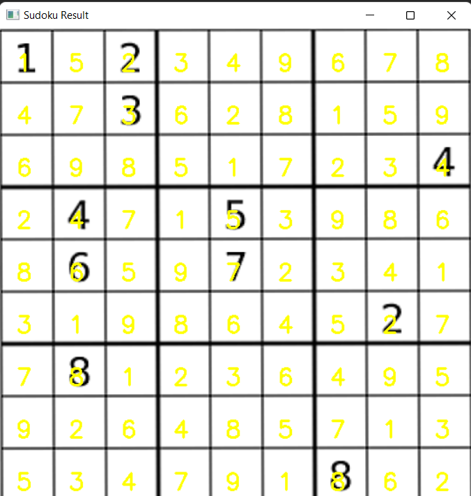

# Sudoku Solver using Computer Vision

<br>
*Sample Output*


This project is an implementation of a Sudoku Solver using Computer Vision techniques. The solver is designed to take an image of a Sudoku puzzle as input, extract the puzzle's digits using image processing, and then solve the puzzle using an algorithmic approach.

## Table of Contents

- [Introduction](#introduction)
- [Installation](#installation)
- [Directory](#directory)
- [Usage](#usage)
- [Methodology](#methodology)
- [Requirements](#requirements)
- [Contributing](#contributing)
- [License](#license)

## Introduction

Sudoku is a popular number puzzle game where the objective is to fill a 9x9 grid with digits in such a way that each column, each row, and each of the nine 3x3 subgrids that compose the grid contains all of the digits from 1 to 9. This project aims to automatically solve a given Sudoku puzzle by leveraging Computer Vision techniques to recognize the digits in the puzzle and an algorithmic approach to find the solution.

## Installation

To set up the Sudoku Solver project on your local machine, follow these steps:

1. Clone the repository:

   ```bash
   git clone https://github.com/imprasukjain/Sudoku_Solver.git
   cd sudoku-solver
   ```

2. Create a virtual environment (optional but recommended):

   ```bash
   python -m venv venv
   source venv/bin/activate
   ```

3. Install the required packages:

   ```bash
   pip install -r requirements.txt
   ```

## Directory

 ```bash
.
├── output
│   └── digit_classifier.h5        # Trained digit classifier model
├── Project_dir
│   ├── models
│   │   ├── __init__.py
│   │   └── Sudokunet.py           # Implementation of the Sudokunet model
│   ├── Sudoku
│   │   ├── __init__.py
│   │   └── puzzle.py              # Sudoku puzzle solving logic
│   └── __init__.py
├── solve_sudoku_puzzle.py         # Script to solve Sudoku puzzles
├── sudoku_puzzle.jpg              # Sample Sudoku puzzle image
└── train_digit_classifier.py      # Script to train the digit classifier
```


## Usage

1. Capture or provide an image of a Sudoku puzzle.

2. Run the `solve_sudoku_puzzle.py` script:

   ```bash
   python solve_sudoku_puzzle.py --model path/to/model.h5 --image path/to/sudoku_image.jpg
   ```

3. The script will process the image, extract the digits using Computer Vision techniques, solve the puzzle, and display the solution.

## Methodology

1. **Digit Extraction**: The provided image is preprocessed using various techniques to enhance the Sudoku grid's visibility and separate the digits from the background.

2. **Digit Recognition**: A machine learning model (MNIST digit classifier) is used to recognize the extracted digits from the Sudoku grid.

3. **Sudoku Solver Algorithm**: Once the digits are recognized, an algorithmic approach such as backtracking is used to solve the Sudoku puzzle.

## Requirements

- Python 3.7+
- OpenCV
- NumPy
- TensorFlow (for digit recognition)
- Other dependencies (see `requirements.txt`)

## Contributing

Contributions are welcome! If you'd like to contribute to this project, please follow the guidelines in the [CONTRIBUTING.md](CONTRIBUTING.md) file.

## License

This project is licensed under the [MIT License](LICENSE).

Feel free to update and customize the README with additional information, screenshots, usage examples, and more.
